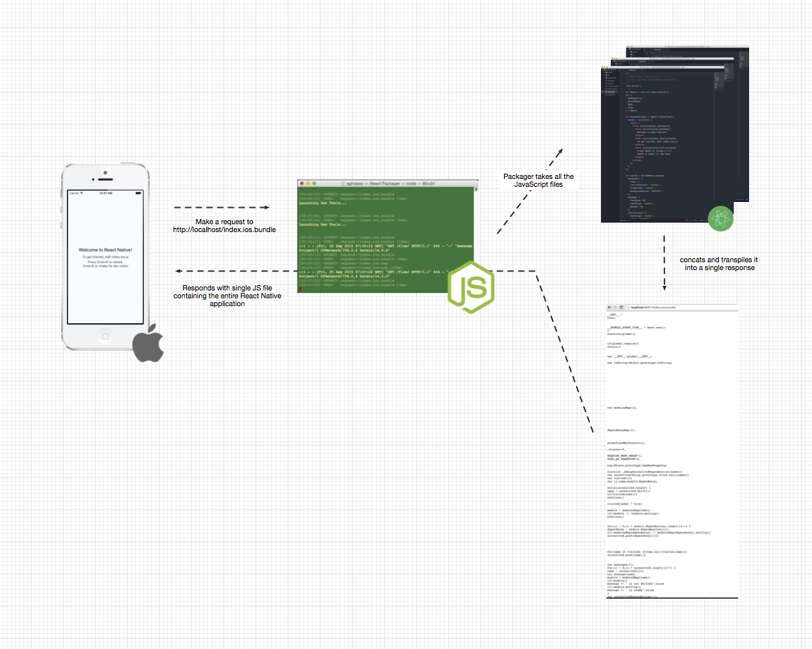
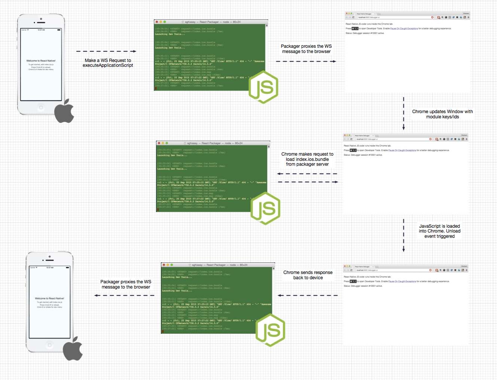

Debugging
---------


### Getting started

Install & launch react-native-debugger

```
brew update && brew cask install react-native-debugger

open rndebugger://set-debugger-loc?port=19001
```


### Debugging JS







### Debugging Native

Launch Xcode
